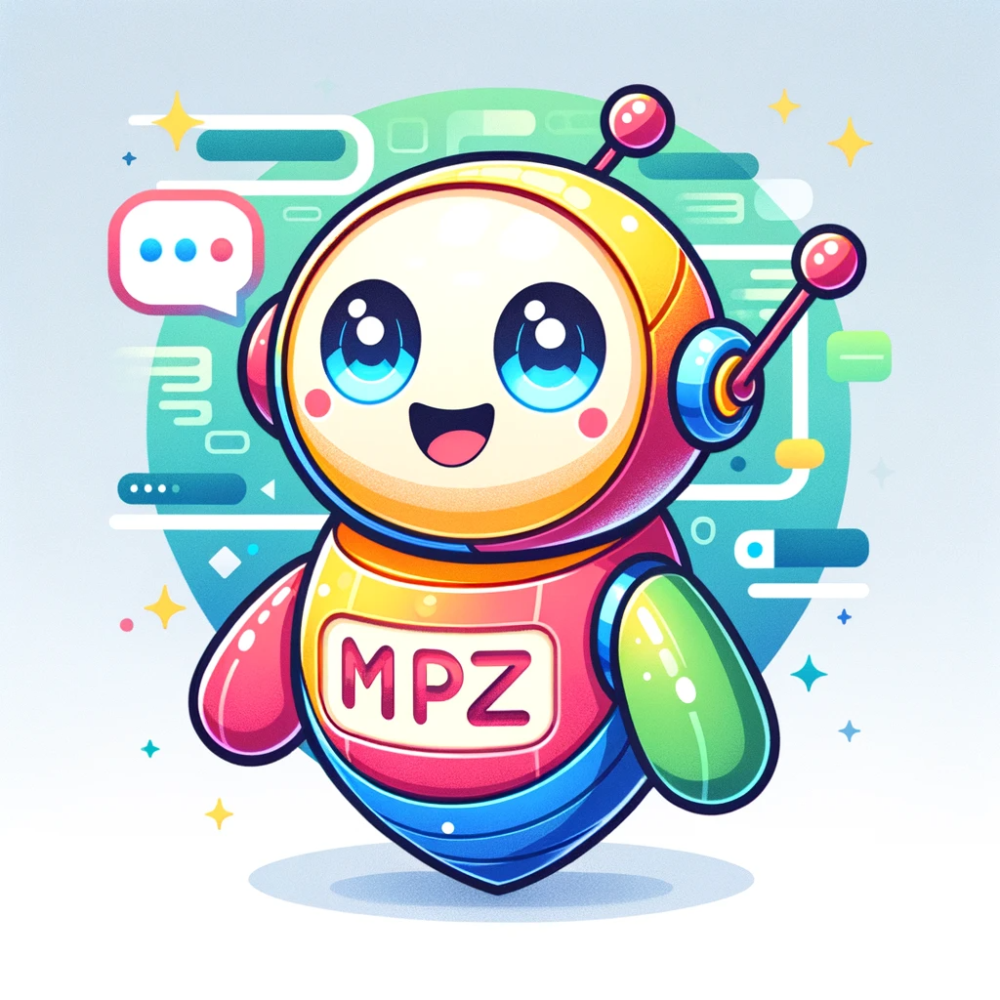
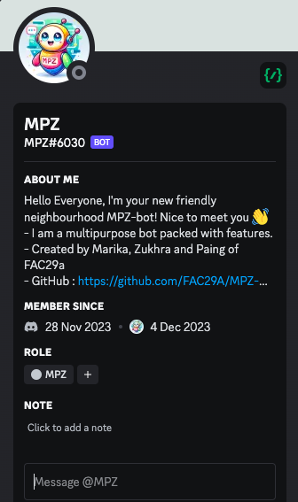
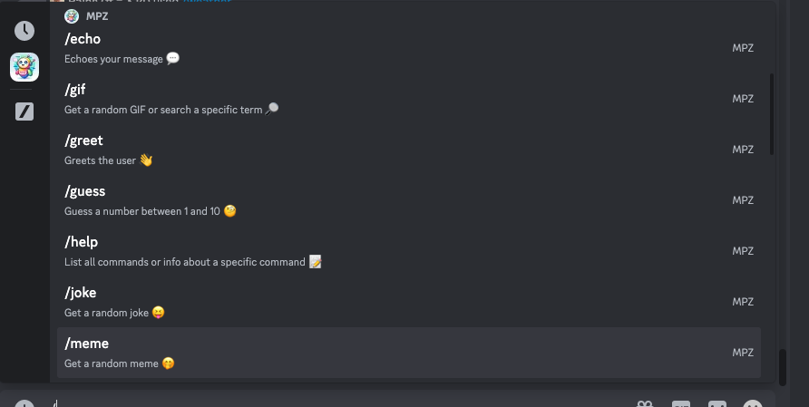
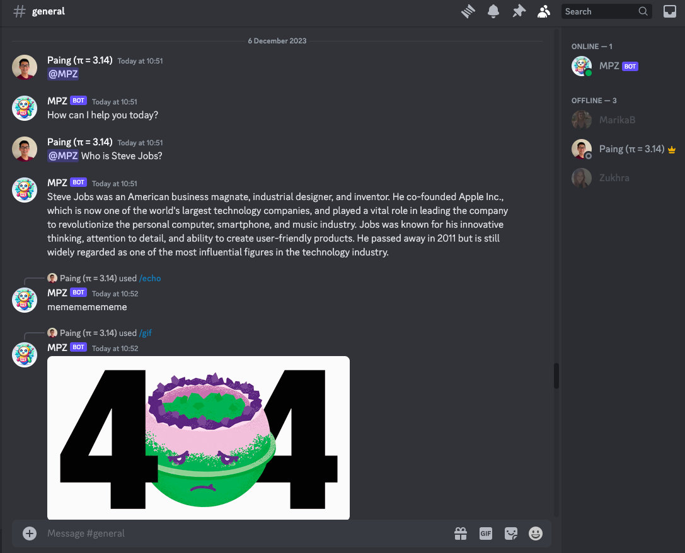
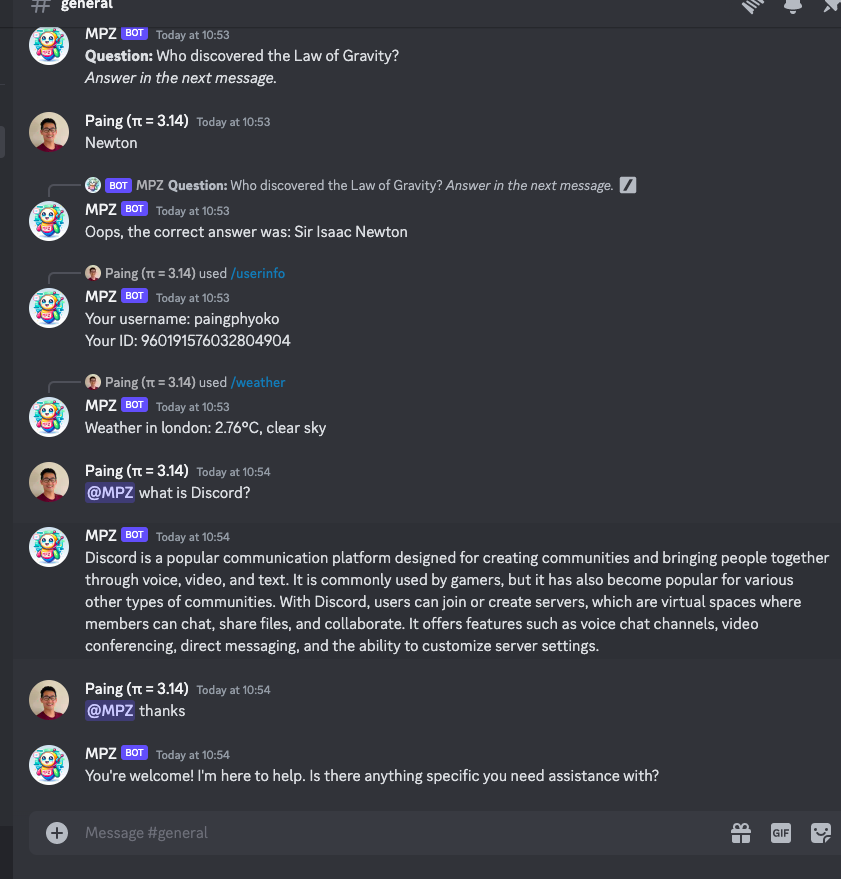
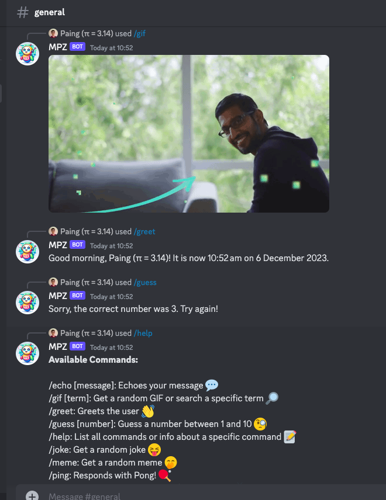

# Team MPZ Discord Bot


<div>


</div>

## Overview
Hello Everyone, I'm your friendly neighborhood MPZbot! Nice to meet you 👋
- Developed by Team MPZ (Marika, Paing & Zukhra from [FAC29A](https://github.com/FAC29A)), I provide various fun and utility commands for Discord server users.
- I can fetch GIFs, memes, weather information, jokes, and more and am designed to be interactive and responsive.

## Getting Started

1. Clone this repository to your local machine.
```bash
git clone https://github.com/FAC29A/MPZ-bot.git
```
2. Navigate to the bot directory:
``` bash
cd MPZ-bot
```
3. Install dependencies by running:
``` bash
npm install
```
4. Create a `.env` file in the project root and add your API keys and Discord token:
``` bash
DISCORD_TOKEN=your_discord_bot_token
OPENAI_API_KEY=your_openai_api_key
GIPHY_API_KEY=your_giphy_api_key
WEATHER_API_KEY=your_openweathermap_api_key
MEME_API_URL=https://api.imgflip.com/get_memes
```

## Usage

Run the bot with:
```bash
node index.js
````
Or use:
```bash
npm run dev
```
for development mode with hot reloading.

## Available Commands


- `/echo [message]`: Echoes your message 💬
- `/gif [term]`: Get a random GIF or search a specific term 🔎
- `/greet`: Greets the user 👋
- `/guess [number]`: Guess a number between 1 and 10 🧐
- `/help`: List all commands or info about a specific command 📝
- `/joke`: Get a random joke 😂
- `/meme`: Get a random meme 🤭
- `/ping`: Responds with Pong! 🏓
- `/play [song] [url]`: Play a song from YouTube 📺
- `/trivia`: Starts a trivia question 🤔
- `/userinfo`: Get your Discord user info ℹ️
- `/weather [city]`: Get the weather for a city 🌦
  
📌 Note: I can assist with general queries using OpenAI integration in the server channels by mentioning me as `@MPZ`. DM assistance is currently under improvement.



## Implementation Details

- The bot uses the Discord.js library for interacting with the Discord API.
- It fetches data from Giphy, Imgflip (for memes), OpenWeatherMap, and an official joke API.
- Last but not least, openAI.
- The bot responds to specific commands triggered by the user in the Discord server.
  
## Contributors

This project was developed as part of a collaborative effort by Team MPZ:
- [Marika](https://github.com/MarikaBBB)
- [Paing](https://github.com/Paing-Ko)
- [Zukhra](https://github.com/Zu18)
  
<div>



</div>
